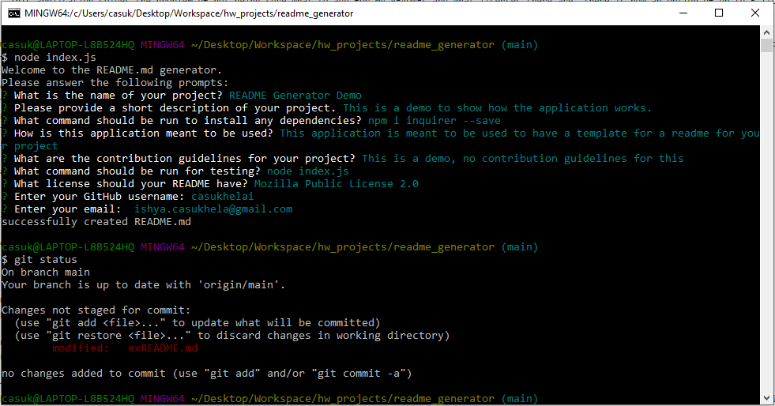

# Professional README Generator

## Description
The Professional README generator is a command-line application. My motivation for this project was to create an application such that I can use this as a template for future READMEs. This application solves the problem of not being sure what to add for my READMEs and what licenses there are. There is now an option of up to 5 licenses and descriptive prompts to make a well detailed README.

This homework taught me patience in debugging. I had a lot of different issues with function calling and the template literals, it took quite a few tries to understand why the application wouldn't deploy appropriately.

## Table of Contents
  * Installation(#installation)
  * Usage(#usage)
  * Contribution(#contribution)
  * Question(#questions)

## Installation
Install the package "inquirer" through the following command:

"npm i inquirer --save"

## Usage
Open up the application in the terminal and type "node index.js". Follow the prompts and voila! You have your README file.
- 
- 

## License
This repository is under the [MIT](https://opensource.org/licenses/MIT) license.

## Contribution Guidelines
There are no contribution guidelines for this project.

## Questions
If you have any further questions please contact me at [ishya.casukhela@gmail.com](mailto:ishya.casukhela@gmail.com). View more of my work [here](https://github.com/casukhelai)!

